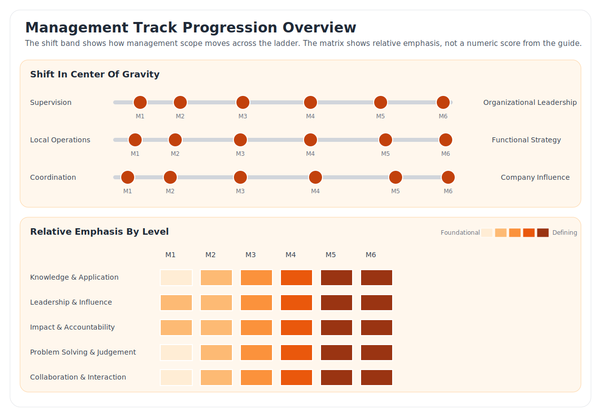
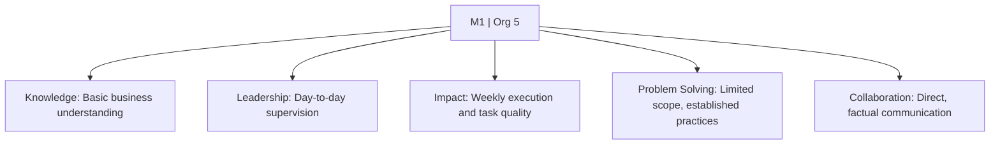
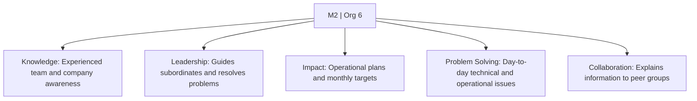
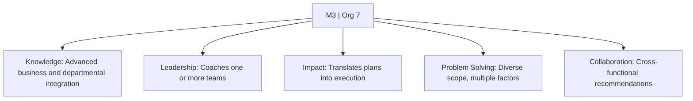
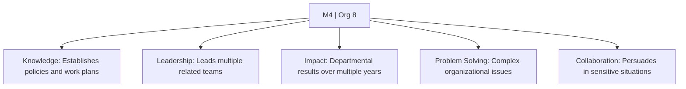
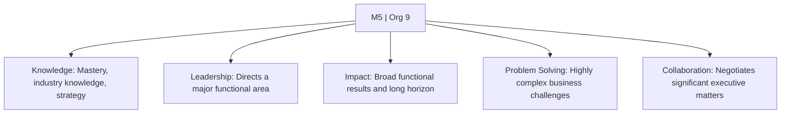
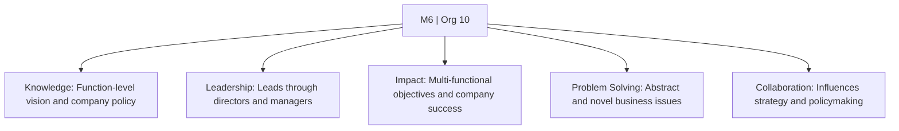

# Management Track

The Management track is the people-leadership ladder. It uses `M1` through `M6` level identifiers aligned with a Management Track leveling model.

Management-track roles achieve impact primarily through others. The ladder expands from direct supervision and local execution into broader organizational leadership, longer planning horizons, and company-level influence.

# General Criteria

* work is achieved primarily through others
* success depends on management capability, business knowledge, and a strong technical foundation
* managers are accountable for direction, resources, people decisions, and team outcomes
* scope usually includes operational processes, budgets, and the performance of a team of 3 or more people

# Level Map

| Org Level | Job Level | Typical Title | Typical Experience | Typical Education |
| :---: | :---: | :--- | :--- | :--- |
| 5 | `M1` | Supervisor or Shift Manager | Less than 1 year management; 1 to 3 years work experience | Bachelor's required |
| 6 | `M2` | Supervisor or Lead | 1+ year management; 3 to 5 years work experience | Bachelor's required |
| 7 | `M3` | Manager | 2+ years management; 8+ years work experience | Bachelor's required |
| 8 | `M4` | Senior Manager or Associate Director | 3 to 5 years management; 8 to 12 years work experience | Bachelor's required; master's or PhD may be preferred |
| 9 | `M5` | Director | 6+ years management; 12 to 15 years work experience | Bachelor's required; master's or PhD may be preferred |
| 10 | `M6` | Senior Director | 10+ years management; 15 to 18 years work experience | Master's or PhD |

# Progression Overview

This draft summary visual is designed to show the shift in center of gravity across the ladder, not just the content of one level in isolation.

# Levels

## M1 - Supervisor / Shift Manager

| Organization Level | Typical Experience | Typical Education |
| :--- | :--- | :--- |
| 5 | Less than 1 year management; 1 to 3 years work experience | Bachelor's required |

* `Knowledge & Application`: Applies a basic understanding of the business and operating practices to help the team achieve objectives.
* `Leadership & Influence`: Provides close day-to-day supervision, assigns work, and monitors task execution frequently.
* `Impact & Accountability`: Operates within policies and procedures and is directly accountable for the quality of routine execution against a weekly plan.
* `Problem Solving & Judgement`: Handles limited-scope issues by following established practices and procedures.
* `Collaboration & Interaction`: Interacts mainly with direct reports and communicates straightforward factual information.

## M2 - Supervisor / Lead

| Organization Level | Typical Experience | Typical Education |
| :--- | :--- | :--- |
| 6 | 1+ year management; 3 to 5 years work experience | Bachelor's required |

* `Knowledge & Application`: Uses a more experienced understanding of business practices and a basic understanding of the broader company to improve efficiency with closely related teams.
* `Leadership & Influence`: Manages subordinates, guides execution, and actively helps resolve problems when needed.
* `Impact & Accountability`: Develops and manages routine operational plans and improves the quality, efficiency, and effectiveness of team output against a monthly plan.
* `Problem Solving & Judgement`: Exercises judgment to troubleshoot day-to-day technical and operational problems and may help define procedures or policies.
* `Collaboration & Interaction`: Works with subordinate supervisors and peer groups and explains information to audiences that are familiar with the subject.

## M3 - Manager

| Organization Level | Typical Experience | Typical Education |
| :--- | :--- | :--- |
| 7 | 2+ years management; 8+ years work experience | Bachelor's required |

* `Knowledge & Application`: Applies advanced business understanding and growing company awareness to integrate the function with adjacent areas and achieve departmental objectives.
* `Leadership & Influence`: Manages and coaches one or more teams, adapting plans and priorities to meet short-term objectives.
* `Impact & Accountability`: Translates functional plans into operational processes and directly affects service, quality, and timeliness goals with up to a one-year horizon.
* `Problem Solving & Judgement`: Works on issues of diverse scope, evaluates multiple factors, and selects methods to resolve technical and operational problems.
* `Collaboration & Interaction`: Partners across functions, presents results and recommendations, and works effectively with customers and peer groups.

## M4 - Senior Manager / Associate Director

| Organization Level | Typical Experience | Typical Education |
| :--- | :--- | :--- |
| 8 | 3 to 5 years management; 8 to 12 years work experience | Bachelor's required; master's or PhD may be preferred |

* `Knowledge & Application`: Applies advanced functional understanding and company awareness to establish operational objectives, policies, procedures, and work plans.
* `Leadership & Influence`: Coaches multiple related teams, sets departmental priorities, and allocates resources to align with business objectives.
* `Impact & Accountability`: Has direct impact on departmental results through support and funding of projects, products, services, or technologies with a medium-term horizon.
* `Problem Solving & Judgement`: Solves complex operational and organizational problems that are not clearly defined and require conceptual thinking.
* `Collaboration & Interaction`: Persuades and influences others in sensitive, complex situations while preserving relationships.

## M5 - Director

| Organization Level | Typical Experience | Typical Education |
| :--- | :--- | :--- |
| 9 | 6+ years management; 12 to 15 years work experience | Bachelor's required; master's or PhD may be preferred |

* `Knowledge & Application`: Applies mastery of the function, broad industry knowledge, and commercial awareness to develop strategic business plans for a major segment of the organization.
* `Leadership & Influence`: Directs a major functional area through subordinate managers, develops new methods, and contributes to long-term functional strategy.
* `Impact & Accountability`: Shapes functional results by allocating resources in light of future business needs, with impact that can extend up to five years.
* `Problem Solving & Judgement`: Evaluates key business challenges, directs the resolution of highly complex problems, and helps define methods and evaluation criteria.
* `Collaboration & Interaction`: Negotiates matters of significance with senior management, executives, and major customers while reconciling multiple stakeholder views.

## M6 - Senior Director

| Organization Level | Typical Experience | Typical Education |
| :--- | :--- | :--- |
| 10 | 10+ years management; 15 to 18 years work experience | Master's or PhD |

* `Knowledge & Application`: Develops strategy, vision, and direction for one or more functions and translates abstract business needs into company-wide practices.
* `Leadership & Influence`: Leads functional areas through subordinate directors or managers who hold operating responsibility for those areas.
* `Impact & Accountability`: Establishes organizational functional strategy and multi-functional objectives with critical long-term impact on company success.
* `Problem Solving & Judgement`: Resolves unique and novel business problems across functions and anticipates factors that affect market position and strategy.
* `Collaboration & Interaction`: Works with internal and external executive audiences on extremely critical matters and is recognized as an influential leader.

# Other Pages

* [**Introduction**](README.html)
* [**Technical Track**](Technical.html)
