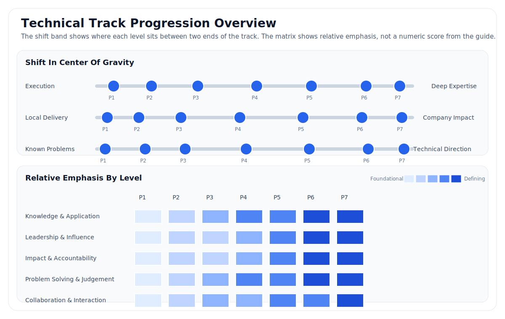
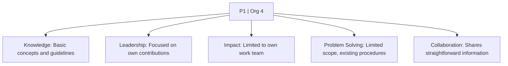
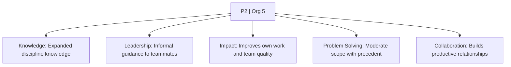
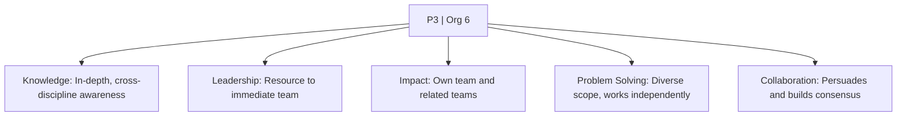
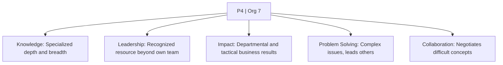
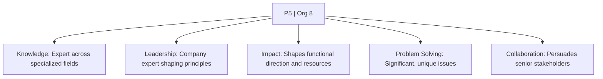
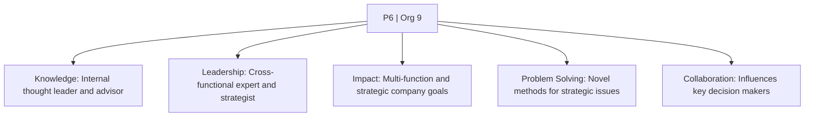
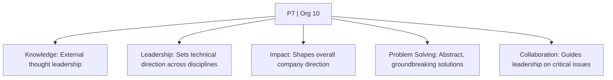

# Technical Track

The Technical track is the Symbotics individual contributor ladder. It is sourced from the internal Professional Track leveling guide and intentionally keeps the official `P1` through `P7` identifiers.

Technical-track roles achieve impact primarily through individual technical contribution, though the higher levels also shape strategy, guide other engineers, and influence business direction.

# General Criteria

* work is achieved primarily through individual contribution
* success depends on applied professional knowledge and strong technical judgment
* the highest levels define discipline strategy within their area of expertise
* leadership can be exercised through technical expertise, project leadership, and influence without direct people management

# Level Map

| Org Level | Job Level | Typical Title | Typical Experience | Typical Education |
| :---: | :---: | :--- | :--- | :--- |
| 4 | `P1` | Coordinator or Associate | Less than 1 year | Bachelor's required |
| 5 | `P2` | Analyst, Engineer, or Specialist | 2+ years related experience or equivalent | Bachelor's required |
| 6 | `P3` | Senior | 5+ years related experience or equivalent | Bachelor's required |
| 7 | `P4` | Staff | 8+ years related experience or equivalent | Bachelor's required; master's or PhD may be preferred |
| 8 | `P5` | Principal | 12+ years related experience or equivalent | Bachelor's required; master's or PhD may be preferred |
| 9 | `P6` | Senior Principal | 15+ years related experience or equivalent | Master's or PhD |
| 10 | `P7` | Distinguished or Fellow | 15+ years; typically known externally in the industry | Master's or PhD |

# Progression Overview

This draft summary visual is designed to show the shift in center of gravity across the ladder, not just the content of one level in isolation.

# Levels

## P1 - Coordinator / Associate

| Organization Level | Typical Experience | Typical Education |
| :--- | :--- | :--- |
| 4 | Less than 1 year | Bachelor's required |

* `Knowledge & Application`: Builds basic conceptual knowledge in the discipline and learns how to apply standard professional concepts.
* `Leadership & Influence`: Focuses on personal delivery against assigned goals.
* `Impact & Accountability`: Impacts the quality and timeliness of work within the immediate team.
* `Problem Solving & Judgement`: Solves limited-scope problems with existing procedures and regular guidance.
* `Collaboration & Interaction`: Exchanges straightforward information, asks questions, and confirms understanding.

## P2 - Analyst / Engineer / Specialist

| Organization Level | Typical Experience | Typical Education |
| :--- | :--- | :--- |
| 5 | 2+ years related experience or equivalent | Bachelor's required |

* `Knowledge & Application`: Develops broader conceptual knowledge in the discipline and can adjust methods for common variations.
* `Leadership & Influence`: Provides informal guidance to team members.
* `Impact & Accountability`: Improves personal output and influences the quality of work produced by others on the team.
* `Problem Solving & Judgement`: Handles moderate-scope problems using learned techniques and judgment grounded in precedent.
* `Collaboration & Interaction`: Builds productive working relationships and explains increasingly complex information to familiar audiences.

## P3 - Senior

| Organization Level | Typical Experience | Typical Education |
| :--- | :--- | :--- |
| 6 | 5+ years related experience or equivalent | Bachelor's required |

* `Knowledge & Application`: Brings in-depth knowledge of the discipline, basic knowledge of related disciplines, and creative thinking in unusual situations.
* `Leadership & Influence`: Acts as a resource to the immediate team and may lead small projects.
* `Impact & Accountability`: Affects a range of work across the immediate team and adjacent teams.
* `Problem Solving & Judgement`: Solves diverse problems with limited information and works independently in day-to-day execution.
* `Collaboration & Interaction`: Adapts communication style, builds broader networks, and starts to persuade others and build consensus.

`P3` is the journey-level position in this ladder.

## P4 - Staff

| Organization Level | Typical Experience | Typical Education |
| :--- | :--- | :--- |
| 7 | 8+ years related experience or equivalent | Bachelor's required; master's or PhD may be preferred |

* `Knowledge & Application`: Applies specialized depth or breadth in the discipline and understands how related disciplines interact.
* `Leadership & Influence`: Is recognized as a resource by others on the team and may lead more complex projects.
* `Impact & Accountability`: Influences customer, program, project, service, or operational objectives and helps deliver tactical business targets.
* `Problem Solving & Judgement`: Leads others through complex, multi-variable issues and identifies innovative solutions aligned to departmental objectives.
* `Collaboration & Interaction`: Communicates difficult concepts, negotiates tradeoffs, and advises others on broader business matters.

## P5 - Principal

| Organization Level | Typical Experience | Typical Education |
| :--- | :--- | :--- |
| 8 | 12+ years related experience or equivalent | Bachelor's required; master's or PhD may be preferred |

* `Knowledge & Application`: Is recognized as an expert within the company across specialized fields or several related disciplines.
* `Leadership & Influence`: Is recognized as an expert within the company and contributes to company objectives and technical principles in creative and effective ways.
* `Impact & Accountability`: Influences the direction, prioritization, and resource allocation of programs, projects, and services across a function.
* `Problem Solving & Judgement`: Solves significant and unique problems that require conceptual thinking, advanced analysis, and judgment on intangible factors.
* `Collaboration & Interaction`: Creates formal networks, anticipates objections, and persuades diverse stakeholders, often at senior levels.

## P6 - Senior Principal

| Organization Level | Typical Experience | Typical Education |
| :--- | :--- | :--- |
| 9 | 15+ years related experience or equivalent | Master's or PhD |

* `Knowledge & Application`: Serves as a company thought leader and principal advisor, and may help shape product or business strategy.
* `Leadership & Influence`: Is recognized as an expert across the company, leads cross-functional initiatives, and develops strategy for project execution.
* `Impact & Accountability`: Affects business direction across multiple functions and is accountable for outcomes tied to strategic company goals.
* `Problem Solving & Judgement`: Solves the most complex strategic problems with novel methods, including future concepts and products.
* `Collaboration & Interaction`: Works directly with senior leaders, key decision makers, and external parties to influence important decisions.

## P7 - Distinguished / Fellow

| Organization Level | Typical Experience | Typical Education |
| :--- | :--- | :--- |
| 10 | 15+ years; typically known externally in the industry | Master's or PhD |

* `Knowledge & Application`: Is recognized externally as a thought leader and brings technical insight that advances innovation, growth, and critical issue resolution.
* `Leadership & Influence`: Leads highly visible multi-disciplinary initiatives and sets technical direction across one or more disciplines.
* `Impact & Accountability`: Shapes overall company direction through decisions that affect long-term success.
* `Problem Solving & Judgement`: Solves the most abstract and complex problems with groundbreaking methods that go beyond existing solutions.
* `Collaboration & Interaction`: Advises leadership on advanced technical matters and is recognized as a technical leader whose ideas influence the organization.

# Other Pages

* [**Introduction**](README.md)
* [**Management Track**](Management.md)
